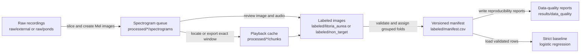

# Frog Classifier Architecture

This document describes the implemented end-to-end architecture and storage contracts.
The [roadmap](../roadmap.md) records future capabilities and acceptance criteria.

## Pipeline



## Storage contract

```text
raw/                         immutable source recordings
processed/                   reproducible spectrograms and playback chunks
labeled/                     human-selected PNGs and generated manifest.csv
labeled/unsure/              clips the reviewer could not decide on, excluded from training
labeled/decisions.csv        append-only log of labeling decisions
config/preprocessing.toml    versioned preprocessing and class contract
results/data_quality/        generated manifest validation reports
models/                      future saved model artifacts
results/analytics/           future inference and analysis outputs
src/frog_classifier/data/    manifest, splitting, validation, reporting, and configuration package
src/frog_classifier/preprocessing/   Mel rendering, per-recording noise floor, PNG encoding, display colours
src/frog_classifier/labeling/   session queue, decision log, moves, playback audio
docs/decisions/              dated design decisions with their evidence
```

Generated recordings, images, manifests, reports, models, and analytics are ignored by Git.
Tracked `.gitkeep` files preserve only the intended empty roots.
The manifest workflow reads labeled images directly, so materialized split directories are not part of the repository layout.

## Preprocessing contract

[`config/preprocessing.toml`](../config/preprocessing.toml) is the machine-readable source of truth for the fixed-window audio, Mel-spectrogram, normalization, rendering, and canonical class settings.
Schema version 2 declares 22,050 Hz mono audio, non-overlapping five-second windows, dropped incomplete final chunks, 128 Mel bins spanning 400 Hz to 4,000 Hz, a per-recording noise floor at the 50th percentile, a 0 dB to 30 dB display range, 8-bit grayscale PNG output with the lowest band at the bottom, and the `litoria_aurea: 1` and `non_target: 0` mapping.
The loader accepts only schema version 2 and tells the operator to regenerate spectrograms when it meets an earlier schema.
The slicer takes every preprocessing value from this file and offers no command-line overrides.
The data package reads the exact TOML bytes and includes their SHA-256 checksum in each generated manifest row.
It rejects non-finite floating-point values before preprocessing begins.

The band was corrected on September 13, 2026 after regeneration from raw audio proved the existing spectrograms were produced with 400 Hz to 4,000 Hz rather than the previously declared 0 Hz to 8,000 Hz.
The noise-floor rendering was adopted the same day; the comparison and reasoning are in [the rendering decision](decisions/2026-09-13-spectrogram-rendering.md).

## Spectrogram rendering

`frog_classifier.preprocessing` renders one recording at a time.
It loads the whole file as mono audio at the configured rate, computes the Mel power spectrogram of the entire file in absolute decibels, and takes the configured percentile of every band across all frames as that band's noise floor.
Each complete five-second chunk is then converted from its own samples, the floor is subtracted per band, and decibels from `db_floor` to `db_ceiling` map linearly to grey levels 0 to 255 with clipping outside that range.
Rows are flipped so the lowest band is the bottom row, and the array is written as a lossless 8-bit grayscale PNG with no metadata, so identical audio always yields identical bytes.
Under the current contract every image is 216 pixels wide and 128 pixels tall.
The labeler shows these images through the viridis colour map for readability; storage stays grayscale.

## Regeneration and verification

`scripts/slice_audio.py` overwrites images by name and never deletes.
`scripts/sync_labeled_images.py` moves each freshly rendered image over its labeled counterpart by name after all names are checked, so a label keeps its identity and the queue no longer holds a labeled example.
`scripts/verify_spectrograms.py` re-renders a seeded sample, or every image with `--all`, from raw audio and compares bytes, which proves the stored images match the tracked contract.

## Human labeling

`scripts/label_frontend.py` is the only labeler; `Launch_Labeler.bat` starts it.
It shows a spectrogram through the viridis colour map with its five-second audio window, which `frog_classifier.labeling.audio` locates in the playback cache or exports from the recording on first use.
In label mode the queue comes from `frog_classifier.labeling.queue`: night clips (19:00 to 06:59) shuffled with a seed, at most five per recording per session, with one daytime clip for every nine night clips.
In audit mode the queue is the labeled folders in the same order, the current class is shown, pressing it confirms, and pressing another class moves the clip.
Frog, Frog faint, Background, and Unsure move the PNG into `labeled/litoria_aurea`, `labeled/non_target`, or `labeled/unsure` through `frog_classifier.labeling.decisions`, which refuses to overwrite and appends one row per press to `labeled/decisions.csv` with the resulting folder, the action (`label`, `confirm`, `change`, or `undo`), the faint flag, and a UTC timestamp.
Skip leaves no record, and Undo reverts only the last move of the session.
The manifest builder skips `labeled/unsure/`, so unsure clips never enter training.

## Versioned manifest and grouped folds

`scripts/build_manifest.py` delegates to `frog_classifier.data` to discover labels, validate filenames and paths, create a class-aware grouped fold plan, and atomically write outputs.
Each row includes `manifest_version`, `example_id`, `image_path`, class metadata, `recording_id`, `start_s`, `fold`, `split`, and `preprocessing_config_sha256`.
All examples from one recording ID receive one fold and one split, preventing recording-level leakage.
The default command uses five folds with fold zero for test data and fold one for validation data.
The validator treats the selected label root as authoritative and requires the first path component beneath it to match the row class.
It re-parses each filename and requires canonical POSIX paths without dot or parent aliases, lowercase PNG suffixes, example IDs, recording IDs, nonnegative aligned start times, and configured class metadata to agree.
It also rejects invalid schemas, missing classes, duplicate identities, missing files, split leakage, and folds or splits that lack either class.
Output safety permits only the lexical, non-symlinked default `labeled/manifest.csv` artifact inside the canonical label tree.
It rejects resolved destination aliases that collide with inputs or fall inside raw, processed, configuration, or selected label source trees.

## Data-quality reports

The manifest command writes JSON and Markdown reports to `results/data_quality/` beside the manifest output.
Each report records manifest and report versions, the fold plan, configuration and manifest checksums, class and recording-group counts, split and fold counts, and validation checks.
The public report builder validates rows, requires the supplied manifest payload to equal their canonical serialization, and verifies exact fold and split agreement with the supplied plan before producing those checks.
The reports make every training and evaluation input inspectable without tracking generated artifacts.

## Strict baseline

`scripts/train_baseline.py` loads the manifest through the same configuration and validation contract.
It trains a balanced logistic-regression classifier on resized grayscale spectrograms only after the strict manifest workflow has produced valid train, validation, and test rows.
The baseline is a data-path and evaluation sanity check rather than a production classifier.
It does not persist a model or perform recording inference.

## Environment contract

Python 3.13 is supported.
`pyproject.toml` declares direct runtime dependencies, `uv.lock` records the resolved environment, and `requirements_labeler.txt` is the generated pip-compatible export used by the Windows launcher.
Create the environment with `uv sync --frozen`.
