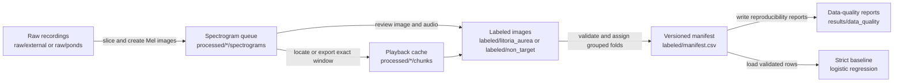

# Frog Classifier Architecture

This document describes the implemented end-to-end architecture and storage contracts.
The [roadmap](../roadmap.md) records future capabilities and acceptance criteria.

## Pipeline



## Storage contract

```text
raw/                         immutable source recordings
processed/                   reproducible spectrograms and playback chunks
labeled/                     human-selected PNGs and generated manifest.csv
config/preprocessing.toml    versioned preprocessing and class contract
results/data_quality/        generated manifest validation reports
models/                      future saved model artifacts
results/analytics/           future inference and analysis outputs
src/frog_classifier/data/    manifest, splitting, validation, reporting, and configuration package
```

Generated recordings, images, manifests, reports, models, and analytics are ignored by Git.
Tracked `.gitkeep` files preserve only the intended empty roots.
The manifest workflow reads labeled images directly, so materialized split directories are not part of the repository layout.

## Preprocessing contract

[`config/preprocessing.toml`](../config/preprocessing.toml) is the machine-readable source of truth for the fixed-window audio, Mel-spectrogram rendering, and canonical class settings.
The configuration declares 22,050 Hz mono audio, non-overlapping five-second windows, dropped incomplete final chunks, 128 Mel bins, axis-free PNG rendering, and the `litoria_aurea: 1` and `non_target: 0` mapping.
The data package reads the exact TOML bytes and includes their SHA-256 checksum in each generated manifest row.
It rejects non-finite floating-point values before preprocessing begins.

## Human labeling

`scripts/label_frontend.py` and `scripts/label_spectrograms.py` present a spectrogram with its matching five-second audio window.
The Streamlit labeler is launched with `Launch_Labeler.bat`, while the Matplotlib labeler remains available for terminal-driven sessions.
Selected images move into `labeled/litoria_aurea` or `labeled/non_target`.
The filename parser derives each recording ID and window start time from the selected PNG name.

## Versioned manifest and grouped folds

`scripts/build_manifest.py` delegates to `frog_classifier.data` to discover labels, validate filenames and paths, create a class-aware grouped fold plan, and atomically write outputs.
Each row includes `manifest_version`, `example_id`, `image_path`, class metadata, `recording_id`, `start_s`, `fold`, `split`, and `preprocessing_config_sha256`.
All examples from one recording ID receive one fold and one split, preventing recording-level leakage.
The default command uses five folds with fold zero for test data and fold one for validation data.
The validator treats the selected label root as authoritative and requires the first path component beneath it to match the row class.
It re-parses each filename and requires canonical POSIX paths without dot or parent aliases, lowercase PNG suffixes, example IDs, recording IDs, nonnegative aligned start times, and configured class metadata to agree.
It also rejects invalid schemas, missing classes, duplicate identities, missing files, split leakage, and folds or splits that lack either class.
Output safety permits only the lexical, non-symlinked default `labeled/manifest.csv` artifact inside the canonical label tree.
It rejects resolved destination aliases that collide with inputs or fall inside raw, processed, configuration, or selected label source trees.

## Data-quality reports

The manifest command writes JSON and Markdown reports to `results/data_quality/` beside the manifest output.
Each report records manifest and report versions, the fold plan, configuration and manifest checksums, class and recording-group counts, split and fold counts, and validation checks.
The public report builder validates rows, requires the supplied manifest payload to equal their canonical serialization, and verifies exact fold and split agreement with the supplied plan before producing those checks.
The reports make every training and evaluation input inspectable without tracking generated artifacts.

## Strict baseline

`scripts/train_baseline.py` loads the manifest through the same configuration and validation contract.
It trains a balanced logistic-regression classifier on resized grayscale spectrograms only after the strict manifest workflow has produced valid train, validation, and test rows.
The baseline is a data-path and evaluation sanity check rather than a production classifier.
It does not persist a model or perform recording inference.

## Environment contract

Python 3.13 is supported.
`pyproject.toml` declares direct runtime dependencies, `uv.lock` records the resolved environment, and `requirements_labeler.txt` is the generated pip-compatible export used by the Windows launcher.
Create the environment with `uv sync --frozen`.
