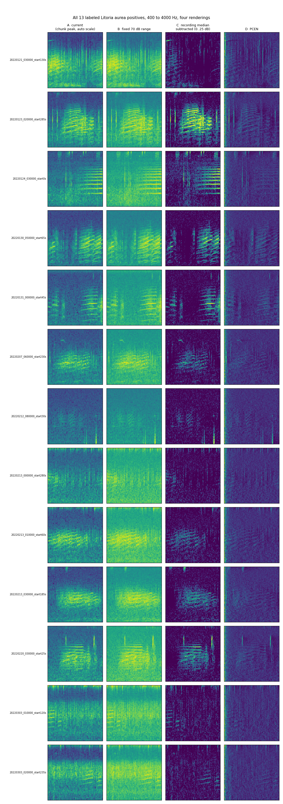
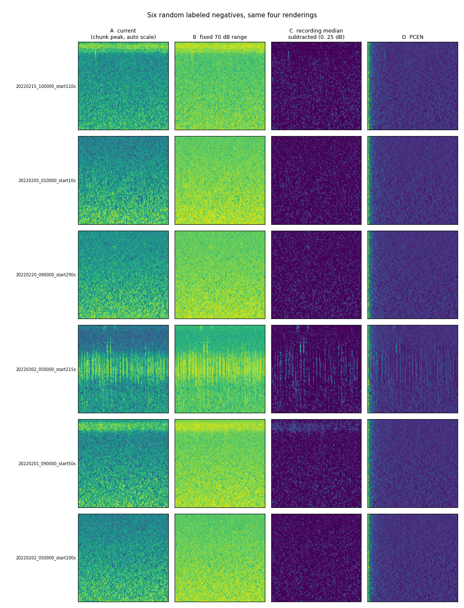

# Decision: spectrogram rendering uses a per-recording noise floor

Date: September 13, 2026

## Context

The original slicer scaled every five-second chunk to its own loudest moment and let Matplotlib stretch the colours between the quietest and loudest pixel of that chunk.
Distant *Litoria aurea* calls that were audible in the playback were washed out whenever the same chunk contained a louder sound such as wind, a bird, or insects.
The same call therefore looked different depending on what else happened in those five seconds, which is a poor input for both human labeling and model training.

## Options compared

All 13 labeled positives and six random labeled negatives were rendered from raw audio under four treatments with the corrected 400 Hz to 4,000 Hz band.

- A: the original rendering, chunk peak reference and automatic colour scale.
- B: a fixed 70 dB dynamic range below the chunk peak.
- C: each Mel band's median level over the whole five-minute recording subtracted, displayed as 0 dB to 25 dB above that floor.
- D: per-channel energy normalization from librosa.

## Decision

Adopt C.

- Ten of thirteen positives show their harmonic stacks clearly against a dark background, and the three faintest remain at least as visible as before on a cleaner background.
- The steady insect band disappears from every negative, while non-stationary sounds such as click trains remain visible and look nothing like the horizontal frog bands.
- B changed almost nothing, so the dynamic range floor was never the problem.
- D gave lower contrast and a bright warm-up stripe on the left edge of every image that a model would learn.
- Pixel intensity under C means decibels above the recording's own noise floor, so brightness is comparable across chunks, nights, and sites.

## Measured parameters

Measured on the 61 labeled recordings:

- The median floor and the 25th percentile floor differ by 2.6 dB on average and 4.3 dB at most, so the percentile is kept configurable and the median is the default.
- The brightest frog pixels reach 31.7 dB above the floor, so the display ceiling is 30 dB rather than the 25 dB used in the comparison sheets.
- Loud non-target transients reach 46 dB and are allowed to saturate.

## Consequences

- The preprocessing contract moves to schema version 2 with a normalization section, which changes the configuration checksum carried by every manifest row.
- All 37,080 spectrograms are regenerated from raw audio and the 61 labeled images are replaced in place by name, so no human label is lost.
- Any future inference must compute the same per-recording floor before rendering chunks.

The implementation design is recorded in [the spectrogram rendering spec](../superpowers/specs/2026-09-13-spectrogram-noise-floor-rendering-design.md).
