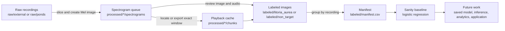

# Frog Classifier System Design

This document describes the current end-to-end architecture, storage contracts, and implemented component boundaries.
The root `roadmap.md` describes planned capabilities that do not yet exist.

## Goals

- Convert long field recordings into fixed five-second examples suitable for machine learning.
- Preserve a deterministic mapping between each spectrogram, its source recording, and its exact time window.
- Support fast human labeling with matching audio playback.
- Prevent direct recording leakage by grouping related chunks during dataset splitting.
- Keep raw recordings immutable and generated artifacts reproducible.

## Pipeline



## Storage contract

```text
raw/
  external/
  ponds/
processed/
  external/
    spectrograms/
    chunks/
  ponds/
    spectrograms/
    chunks/
labeled/
  litoria_aurea/
  non_target/
  manifest.csv
dataset/
  train/{litoria_aurea,non_target}/
  val/{litoria_aurea,non_target}/
  test/{litoria_aurea,non_target}/
models/
results/analytics/
classifier_app/
scripts/
```

The `raw/` tree contains immutable source recordings.
The `processed/` tree contains reproducible spectrograms and cached playback chunks.
The `labeled/` tree contains the human decisions used to build manifests.
The `dataset/` tree is reserved for any future materialized split layout, while current training reads the manifest directly.
The `models/` and `results/` trees are reserved for later phases and currently contain no artifacts.

All generated content is ignored by Git.
Tracked `.gitkeep` files preserve the intended empty directory skeleton in a fresh clone.

## Component 1: Spectrogram generation

Script: `scripts/slice_audio.py`

### Responsibility

Walk a nested audio tree, load each supported recording as mono audio, slice it into non-overlapping windows, and save a Mel-spectrogram PNG for each complete window.

### Default inputs and outputs

- Input: `raw/external`
- Output: `processed/external/spectrograms`
- Supported extensions: `.wav` and `.mp3`, case-insensitive

### Key invariants

- Default chunk duration is five seconds.
- Default sample rate is 22,050 Hz.
- Default Mel bin count is 128.
- Default frequency range is 0 Hz to 8,000 Hz.
- The final partial window is dropped.
- Output directories mirror the input tree beneath the selected roots.
- Output filenames use `<recording_stem>_start<seconds>s.png`.

### Example

```powershell
uv run python scripts/slice_audio.py
```

## Component 2: Human labeling

Scripts: `scripts/label_frontend.py` and `scripts/label_spectrograms.py`

### Responsibility

Present each spectrogram with the matching audio window and move the PNG into its selected class directory.

### Default paths

- Spectrogram input: `processed/external/spectrograms`
- Raw audio lookup: `raw/external`
- Playback cache: `processed/external/chunks`
- Label output: `labeled`

### Class contract

- `litoria_aurea` maps to numeric label `1`.
- `non_target` maps to numeric label `0`.
- Interface text may say Frog or Background, but stored class names always use the canonical identifiers.

### Audio mapping

For `recording01_start30s.png`, the labeler parses recording stem `recording01` and start time `30`.
It first looks for a matching cached WAV beneath the selected chunk root.
If none exists, it locates the mirrored raw recording, loads only the requested five-second window, writes a mono 16-bit WAV, and presents that file for playback.

### Interfaces

The Streamlit interface is the recommended workflow and is launched by `Launch_Labeler.bat`.
The Matplotlib interface remains available for terminal-driven sessions.

## Component 3: Manifest generation

Script: `scripts/build_manifest.py`

### Responsibility

Scan the two label directories, parse metadata from filenames, and write a CSV consumed by the baseline trainer.

### Output schema

```text
image_path,label,label_name,recording_id,start_s,split
```

### Leakage control

The current algorithm assigns all chunks from one recording ID to the same partition.
This prevents chunks from one recording appearing in both training and evaluation data.
The current algorithm does not stratify recording groups by class, so a small label set can produce validation or test partitions containing only one class.
Phase 2 of the roadmap must correct and validate this before metrics are used for decisions.

### Example

```powershell
uv run python scripts/build_manifest.py
```

## Component 4: Sanity baseline

Script: `scripts/train_baseline.py`

### Responsibility

Load manifest rows, resize PNGs to grayscale feature arrays, train a balanced logistic-regression classifier, and print metrics for available partitions.

This component checks that the data path can reach a training loop.
It does not persist a model, run inference on recordings, or represent the intended production architecture.

### Example

```powershell
uv run python scripts/train_baseline.py
```

## Dependency contract

`pyproject.toml` declares the supported Python release and direct runtime dependencies.
`uv.lock` records the exact resolved dependency graph.
`requirements_labeler.txt` is a generated pip-compatible export used by the Windows launcher.

Development setup:

```powershell
uv sync --frozen
```

Lock and compatibility-export refresh:

```powershell
uv lock
uv export --frozen --no-dev --no-hashes --format requirements-txt --output-file requirements_labeler.txt
```

## Current boundaries

The following capabilities are deliberately absent from the current implementation:

- A class-balanced, group-aware evaluation strategy
- Automated label and filename integrity checks beyond repository reproducibility
- A saved CNN or transfer-learning model
- Batch inference over new recordings
- Structured detection outputs with timestamps and confidence
- Activity analytics and visualizations
- A completed user-facing classifier application

These capabilities are sequenced in `roadmap.md` so trustworthy evaluation precedes model expansion and product work.
